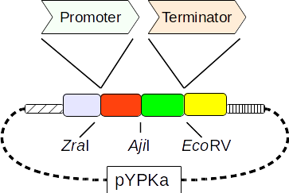

# Yeast pathway kit promoter and terminator vectors

This table contain a total of 55 regulatory sequences cloned in a total of 55 vectors based on 
the [pYPKa](files/pYPKa.gb) vector. Inserts are intergenic sequences from S. cerevisiae tandemly 
expressed genes, so they can function as both promoters and terminators. 

Sequences were cloned  in either the [ZraI](http://rebase.neb.com/rebase/enz/ZraI.html)
or the [EcoRV](http://rebase.neb.com/rebase/enz/EcoRV.html) site to function as promoters or terminators, respectively.

Plasmids with an insert in [ZraI](http://rebase.neb.com/rebase/enz/ZraI.html) are named
pYPKa_Z_* (promoters) and plasmids with an insert in [EcoRV](http://rebase.neb.com/rebase/enz/EcoRV.html) are named
pYPKa_E_* (terminators).

Each vector is described using [pydna](https://bmcbioinformatics.biomedcentral.com/articles/10.1186/s12859-015-0544-x) 
in a [Jupyter notebook](http://nbviewer.jupyter.org).

| No. | TP | Promoter vector | Terminator vector | Jupyter nb |
|-----|----|-----------------|-------------------|------------|
|0 |ARF1 | [pYPKa_Z_ARF1.gb](pYPKa_ZE/pYPKa_Z_ARF1.gb) | [pYPKa_E_ARF1.gb](pYPKa_ZE/pYPKa_E_ARF1.gb) | [nb](pYPKa_ZE/pYPKa_ZE_ARF1.ipynb) |
|1 |ASC1 | [pYPKa_Z_ASC1.gb](pYPKa_ZE/pYPKa_Z_ASC1.gb) | [pYPKa_E_ASC1.gb](pYPKa_ZE/pYPKa_E_ASC1.gb) | [nb](pYPKa_ZE/pYPKa_ZE_ASC1.ipynb) |
|2 |CIS3 | [pYPKa_Z_CIS3.gb](pYPKa_ZE/pYPKa_Z_CIS3.gb) | [pYPKa_E_CIS3.gb](pYPKa_ZE/pYPKa_E_CIS3.gb) | [nb](pYPKa_ZE/pYPKa_ZE_CIS3.ipynb) |
|3 |DSE2 | [pYPKa_Z_DSE2.gb](pYPKa_ZE/pYPKa_Z_DSE2.gb) | [pYPKa_E_DSE2.gb](pYPKa_ZE/pYPKa_E_DSE2.gb) | [nb](pYPKa_ZE/pYPKa_ZE_DSE2.ipynb) |
|4 |DYS1 | [pYPKa_Z_DYS1.gb](pYPKa_ZE/pYPKa_Z_DYS1.gb) | [pYPKa_E_DYS1.gb](pYPKa_ZE/pYPKa_E_DYS1.gb) | [nb](pYPKa_ZE/pYPKa_ZE_DYS1.ipynb) |
|5 |FBA1 | [pYPKa_Z_FBA1.gb](pYPKa_ZE/pYPKa_Z_FBA1.gb) | [pYPKa_E_FBA1.gb](pYPKa_ZE/pYPKa_E_FBA1.gb) | [nb](pYPKa_ZE/pYPKa_ZE_FBA1.ipynb) |
|6 |GIS2 | [pYPKa_Z_GIS2.gb](pYPKa_ZE/pYPKa_Z_GIS2.gb) | [pYPKa_E_GIS2.gb](pYPKa_ZE/pYPKa_E_GIS2.gb) | [nb](pYPKa_ZE/pYPKa_ZE_GIS2.ipynb) |
|7 |HIS1 | [pYPKa_Z_HIS1.gb](pYPKa_ZE/pYPKa_Z_HIS1.gb) | [pYPKa_E_HIS1.gb](pYPKa_ZE/pYPKa_E_HIS1.gb) | [nb](pYPKa_ZE/pYPKa_ZE_HIS1.ipynb) |
|8 |PDC1 | [pYPKa_Z_PDC1.gb](pYPKa_ZE/pYPKa_Z_PDC1.gb) | [pYPKa_E_PDC1.gb](pYPKa_ZE/pYPKa_E_PDC1.gb) | [nb](pYPKa_ZE/pYPKa_ZE_PDC1.ipynb) |
|9 |PFY1 | [pYPKa_Z_PFY1.gb](pYPKa_ZE/pYPKa_Z_PFY1.gb) | [pYPKa_E_PFY1.gb](pYPKa_ZE/pYPKa_E_PFY1.gb) | [nb](pYPKa_ZE/pYPKa_ZE_PFY1.ipynb) |
|10 |PMP3 | [pYPKa_Z_PMP3.gb](pYPKa_ZE/pYPKa_Z_PMP3.gb) | [pYPKa_E_PMP3.gb](pYPKa_ZE/pYPKa_E_PMP3.gb) | [nb](pYPKa_ZE/pYPKa_ZE_PMP3.ipynb) |
|11 |PRE8 | [pYPKa_Z_PRE8.gb](pYPKa_ZE/pYPKa_Z_PRE8.gb) | [pYPKa_E_PRE8.gb](pYPKa_ZE/pYPKa_E_PRE8.gb) | [nb](pYPKa_ZE/pYPKa_ZE_PRE8.ipynb) |
|12 |RHO1 | [pYPKa_Z_RHO1.gb](pYPKa_ZE/pYPKa_Z_RHO1.gb) | [pYPKa_E_RHO1.gb](pYPKa_ZE/pYPKa_E_RHO1.gb) | [nb](pYPKa_ZE/pYPKa_ZE_RHO1.ipynb) |
|13 |RPL11B | [pYPKa_Z_RPL11B.gb](pYPKa_ZE/pYPKa_Z_RPL11B.gb) | [pYPKa_E_RPL11B.gb](pYPKa_ZE/pYPKa_E_RPL11B.gb) | [nb](pYPKa_ZE/pYPKa_ZE_RPL11B.ipynb) |
|14 |RPL12A | [pYPKa_Z_RPL12A.gb](pYPKa_ZE/pYPKa_Z_RPL12A.gb) | [pYPKa_E_RPL12A.gb](pYPKa_ZE/pYPKa_E_RPL12A.gb) | [nb](pYPKa_ZE/pYPKa_ZE_RPL12A.ipynb) |
|15 |RPL12B | [pYPKa_Z_RPL12B.gb](pYPKa_ZE/pYPKa_Z_RPL12B.gb) | [pYPKa_E_RPL12B.gb](pYPKa_ZE/pYPKa_E_RPL12B.gb) | [nb](pYPKa_ZE/pYPKa_ZE_RPL12B.ipynb) |
|16 |RPL14B | [pYPKa_Z_RPL14B.gb](pYPKa_ZE/pYPKa_Z_RPL14B.gb) | [pYPKa_E_RPL14B.gb](pYPKa_ZE/pYPKa_E_RPL14B.gb) | [nb](pYPKa_ZE/pYPKa_ZE_RPL14B.ipynb) |
|17 |RPL16A | [pYPKa_Z_RPL16A.gb](pYPKa_ZE/pYPKa_Z_RPL16A.gb) | [pYPKa_E_RPL16A.gb](pYPKa_ZE/pYPKa_E_RPL16A.gb) | [nb](pYPKa_ZE/pYPKa_ZE_RPL16A.ipynb) |
|18 |RPL16B | [pYPKa_Z_RPL16B.gb](pYPKa_ZE/pYPKa_Z_RPL16B.gb) | [pYPKa_E_RPL16B.gb](pYPKa_ZE/pYPKa_E_RPL16B.gb) | [nb](pYPKa_ZE/pYPKa_ZE_RPL16B.ipynb) |
|19 |RPL17A | [pYPKa_Z_RPL17A.gb](pYPKa_ZE/pYPKa_Z_RPL17A.gb) | [pYPKa_E_RPL17A.gb](pYPKa_ZE/pYPKa_E_RPL17A.gb) | [nb](pYPKa_ZE/pYPKa_ZE_RPL17A.ipynb) |
|20 |RPL1A | [pYPKa_Z_RPL1A.gb](pYPKa_ZE/pYPKa_Z_RPL1A.gb) | [pYPKa_E_RPL1A.gb](pYPKa_ZE/pYPKa_E_RPL1A.gb) | [nb](pYPKa_ZE/pYPKa_ZE_RPL1A.ipynb) |
|21 |RPL20B | [pYPKa_Z_RPL20B.gb](pYPKa_ZE/pYPKa_Z_RPL20B.gb) | [pYPKa_E_RPL20B.gb](pYPKa_ZE/pYPKa_E_RPL20B.gb) | [nb](pYPKa_ZE/pYPKa_ZE_RPL20B.ipynb) |
|22 |RPL21A | [pYPKa_Z_RPL21A.gb](pYPKa_ZE/pYPKa_Z_RPL21A.gb) | [pYPKa_E_RPL21A.gb](pYPKa_ZE/pYPKa_E_RPL21A.gb) | [nb](pYPKa_ZE/pYPKa_ZE_RPL21A.ipynb) |
|23 |RPL21B | [pYPKa_Z_RPL21B.gb](pYPKa_ZE/pYPKa_Z_RPL21B.gb) | [pYPKa_E_RPL21B.gb](pYPKa_ZE/pYPKa_E_RPL21B.gb) | [nb](pYPKa_ZE/pYPKa_ZE_RPL21B.ipynb) |
|24 |RPL22A | [pYPKa_Z_RPL22A.gb](pYPKa_ZE/pYPKa_Z_RPL22A.gb) | [pYPKa_E_RPL22A.gb](pYPKa_ZE/pYPKa_E_RPL22A.gb) | [nb](pYPKa_ZE/pYPKa_ZE_RPL22A.ipynb) |
|25 |RPL23A | [pYPKa_Z_RPL23A.gb](pYPKa_ZE/pYPKa_Z_RPL23A.gb) | [pYPKa_E_RPL23A.gb](pYPKa_ZE/pYPKa_E_RPL23A.gb) | [nb](pYPKa_ZE/pYPKa_ZE_RPL23A.ipynb) |
|26 |RPL2A | [pYPKa_Z_RPL2A.gb](pYPKa_ZE/pYPKa_Z_RPL2A.gb) | [pYPKa_E_RPL2A.gb](pYPKa_ZE/pYPKa_E_RPL2A.gb) | [nb](pYPKa_ZE/pYPKa_ZE_RPL2A.ipynb) |
|27 |RPL2B | [pYPKa_Z_RPL2B.gb](pYPKa_ZE/pYPKa_Z_RPL2B.gb) | [pYPKa_E_RPL2B.gb](pYPKa_ZE/pYPKa_E_RPL2B.gb) | [nb](pYPKa_ZE/pYPKa_ZE_RPL2B.ipynb) |
|28 |RPL31B | [pYPKa_Z_RPL31B.gb](pYPKa_ZE/pYPKa_Z_RPL31B.gb) | [pYPKa_E_RPL31B.gb](pYPKa_ZE/pYPKa_E_RPL31B.gb) | [nb](pYPKa_ZE/pYPKa_ZE_RPL31B.ipynb) |
|29 |RPL34A | [pYPKa_Z_RPL34A.gb](pYPKa_ZE/pYPKa_Z_RPL34A.gb) | [pYPKa_E_RPL34A.gb](pYPKa_ZE/pYPKa_E_RPL34A.gb) | [nb](pYPKa_ZE/pYPKa_ZE_RPL34A.ipynb) |
|30 |RPL34B | [pYPKa_Z_RPL34B.gb](pYPKa_ZE/pYPKa_Z_RPL34B.gb) | [pYPKa_E_RPL34B.gb](pYPKa_ZE/pYPKa_E_RPL34B.gb) | [nb](pYPKa_ZE/pYPKa_ZE_RPL34B.ipynb) |
|31 |RPL35A | [pYPKa_Z_RPL35A.gb](pYPKa_ZE/pYPKa_Z_RPL35A.gb) | [pYPKa_E_RPL35A.gb](pYPKa_ZE/pYPKa_E_RPL35A.gb) | [nb](pYPKa_ZE/pYPKa_ZE_RPL35A.ipynb) |
|32 |RPL35B | [pYPKa_Z_RPL35B.gb](pYPKa_ZE/pYPKa_Z_RPL35B.gb) | [pYPKa_E_RPL35B.gb](pYPKa_ZE/pYPKa_E_RPL35B.gb) | [nb](pYPKa_ZE/pYPKa_ZE_RPL35B.ipynb) |
|33 |RPL36A | [pYPKa_Z_RPL36A.gb](pYPKa_ZE/pYPKa_Z_RPL36A.gb) | [pYPKa_E_RPL36A.gb](pYPKa_ZE/pYPKa_E_RPL36A.gb) | [nb](pYPKa_ZE/pYPKa_ZE_RPL36A.ipynb) |
|34 |RPL36B | [pYPKa_Z_RPL36B.gb](pYPKa_ZE/pYPKa_Z_RPL36B.gb) | [pYPKa_E_RPL36B.gb](pYPKa_ZE/pYPKa_E_RPL36B.gb) | [nb](pYPKa_ZE/pYPKa_ZE_RPL36B.ipynb) |
|35 |RPL41A | [pYPKa_Z_RPL41A.gb](pYPKa_ZE/pYPKa_Z_RPL41A.gb) | [pYPKa_E_RPL41A.gb](pYPKa_ZE/pYPKa_E_RPL41A.gb) | [nb](pYPKa_ZE/pYPKa_ZE_RPL41A.ipynb) |
|36 |RPL42A | [pYPKa_Z_RPL42A.gb](pYPKa_ZE/pYPKa_Z_RPL42A.gb) | [pYPKa_E_RPL42A.gb](pYPKa_ZE/pYPKa_E_RPL42A.gb) | [nb](pYPKa_ZE/pYPKa_ZE_RPL42A.ipynb) |
|37 |RPL5 | [pYPKa_Z_RPL5.gb](pYPKa_ZE/pYPKa_Z_RPL5.gb) | [pYPKa_E_RPL5.gb](pYPKa_ZE/pYPKa_E_RPL5.gb) | [nb](pYPKa_ZE/pYPKa_ZE_RPL5.ipynb) |
|38 |RPL6A | [pYPKa_Z_RPL6A.gb](pYPKa_ZE/pYPKa_Z_RPL6A.gb) | [pYPKa_E_RPL6A.gb](pYPKa_ZE/pYPKa_E_RPL6A.gb) | [nb](pYPKa_ZE/pYPKa_ZE_RPL6A.ipynb) |
|39 |RPS18B | [pYPKa_Z_RPS18B.gb](pYPKa_ZE/pYPKa_Z_RPS18B.gb) | [pYPKa_E_RPS18B.gb](pYPKa_ZE/pYPKa_E_RPS18B.gb) | [nb](pYPKa_ZE/pYPKa_ZE_RPS18B.ipynb) |
|40 |RPS19a | [pYPKa_Z_RPS19a.gb](pYPKa_ZE/pYPKa_Z_RPS19a.gb) | [pYPKa_E_RPS19a.gb](pYPKa_ZE/pYPKa_E_RPS19a.gb) | [nb](pYPKa_ZE/pYPKa_ZE_RPS19a.ipynb) |
|41 |RPS19b | [pYPKa_Z_RPS19b.gb](pYPKa_ZE/pYPKa_Z_RPS19b.gb) | [pYPKa_E_RPS19b.gb](pYPKa_ZE/pYPKa_E_RPS19b.gb) | [nb](pYPKa_ZE/pYPKa_ZE_RPS19b.ipynb) |
|42 |RPS7B | [pYPKa_Z_RPS7B.gb](pYPKa_ZE/pYPKa_Z_RPS7B.gb) | [pYPKa_E_RPS7B.gb](pYPKa_ZE/pYPKa_E_RPS7B.gb) | [nb](pYPKa_ZE/pYPKa_ZE_RPS7B.ipynb) |
|43 |SSS1 | [pYPKa_Z_SSS1.gb](pYPKa_ZE/pYPKa_Z_SSS1.gb) | [pYPKa_E_SSS1.gb](pYPKa_ZE/pYPKa_E_SSS1.gb) | [nb](pYPKa_ZE/pYPKa_ZE_SSS1.ipynb) |
|44 |TDH3 | [pYPKa_Z_TDH3.gb](pYPKa_ZE/pYPKa_Z_TDH3.gb) | [pYPKa_E_TDH3.gb](pYPKa_ZE/pYPKa_E_TDH3.gb) | [nb](pYPKa_ZE/pYPKa_ZE_TDH3.ipynb) |
|45 |TEF1 | [pYPKa_Z_TEF1.gb](pYPKa_ZE/pYPKa_Z_TEF1.gb) | [pYPKa_E_TEF1.gb](pYPKa_ZE/pYPKa_E_TEF1.gb) | [nb](pYPKa_ZE/pYPKa_ZE_TEF1.ipynb) |
|46 |TIF1 | [pYPKa_Z_TIF1.gb](pYPKa_ZE/pYPKa_Z_TIF1.gb) | [pYPKa_E_TIF1.gb](pYPKa_ZE/pYPKa_E_TIF1.gb) | [nb](pYPKa_ZE/pYPKa_ZE_TIF1.ipynb) |
|47 |TIF35 | [pYPKa_Z_TIF35.gb](pYPKa_ZE/pYPKa_Z_TIF35.gb) | [pYPKa_E_TIF35.gb](pYPKa_ZE/pYPKa_E_TIF35.gb) | [nb](pYPKa_ZE/pYPKa_ZE_TIF35.ipynb) |
|48 |TMA19 | [pYPKa_Z_TMA19.gb](pYPKa_ZE/pYPKa_Z_TMA19.gb) | [pYPKa_E_TMA19.gb](pYPKa_ZE/pYPKa_E_TMA19.gb) | [nb](pYPKa_ZE/pYPKa_ZE_TMA19.ipynb) |
|49 |TOM6 | [pYPKa_Z_TOM6.gb](pYPKa_ZE/pYPKa_Z_TOM6.gb) | [pYPKa_E_TOM6.gb](pYPKa_ZE/pYPKa_E_TOM6.gb) | [nb](pYPKa_ZE/pYPKa_ZE_TOM6.ipynb) |
|50 |TOM7 | [pYPKa_Z_TOM7.gb](pYPKa_ZE/pYPKa_Z_TOM7.gb) | [pYPKa_E_TOM7.gb](pYPKa_ZE/pYPKa_E_TOM7.gb) | [nb](pYPKa_ZE/pYPKa_ZE_TOM7.ipynb) |
|51 |TPI1 | [pYPKa_Z_TPI1.gb](pYPKa_ZE/pYPKa_Z_TPI1.gb) | [pYPKa_E_TPI1.gb](pYPKa_ZE/pYPKa_E_TPI1.gb) | [nb](pYPKa_ZE/pYPKa_ZE_TPI1.ipynb) |
|52 |TSA1 | [pYPKa_Z_TSA1.gb](pYPKa_ZE/pYPKa_Z_TSA1.gb) | [pYPKa_E_TSA1.gb](pYPKa_ZE/pYPKa_E_TSA1.gb) | [nb](pYPKa_ZE/pYPKa_ZE_TSA1.ipynb) |
|53 |UTR2 | [pYPKa_Z_UTR2.gb](pYPKa_ZE/pYPKa_Z_UTR2.gb) | [pYPKa_E_UTR2.gb](pYPKa_ZE/pYPKa_E_UTR2.gb) | [nb](pYPKa_ZE/pYPKa_ZE_UTR2.ipynb) |
|54 |ZEO1 | [pYPKa_Z_ZEO1.gb](pYPKa_ZE/pYPKa_Z_ZEO1.gb) | [pYPKa_E_ZEO1.gb](pYPKa_ZE/pYPKa_E_ZEO1.gb) | [nb](pYPKa_ZE/pYPKa_ZE_ZEO1.ipynb) |

